# 中医声诊样本风险三分类实验报告

> 生成日期：2026-09-24。本报告全部指标来自真实运行（嵌套交叉验证外层折外预测）。

## 1 摘要

在当前 27 条样本、外层 5 折内层 3 折嵌套 CV 方案下，按**预先固定**的 macro-F1 规则，胜者为 **Random Forest (随机森林)**（OOF macro-F1=0.5386、Accuracy=0.5556）。

但必须同时说明三点：

1. **它只在部分指标上胜出。** macro ROC-AUC 与 mAP 最好的调参模型分别是 XGBoost（AUC=0.6584）与 XGBoost（mAP=0.5425），不能说随机森林在所有指标上都最优。
2. **胜者的分数含事后挑选的乐观性。** 它是在同一批折外预测上挑出的最高分；各模型的嵌套评估不能自动成为「获胜模型选择过程」的无偏估计。（报告 §4.11 另给出一个不含事后挑选的内层选择策略结果作为对照，但那是**另一套策略**的表现，两者之差不可解释为偏差大小。）
3. **逐类看，最要紧的问题是高危类几乎识别不出**（召回率见 §4.8）。整体 Accuracy 主要由低危与中危两类支撑。

调参对个别模型有提升（如随机森林、XGBoost），对部分模型反而下降，反映出小样本下内层选择噪声大。受样本量限制，所有模型 OOF 指标波动较大，不能据此声称临床部署有效或外部人群泛化良好。

## 2 数据与实验设置

- 输入附件：`inputs/声诊练习.xlsx`（27 条有效样本 × 10 个数值特征）、`inputs/中医声诊实验.docx`（实验背景参考）。
- 特征列（表头原样保留，`FO` 为字母 O，未改作 `F0`）：FO, I, F1, F2, F3, F4, B1, B2, B3, B4。
- 类别映射（固定）：低危=0，中危=1，高危=2；三类各 9 条。
- 切分：外层 5 折、内层 3 折分层嵌套交叉验证，`StratifiedKFold(shuffle=True, random_state=42)`；所有模型共享同一组外层索引。
- 调参：内层主评分固定 macro-F1；LR/SVM/GNB/KNN 用 GridSearchCV，RF/XGBoost 用 RandomizedSearchCV（每折 ≤ 20 候选）；所有拟合型预处理均位于 Pipeline 内、只在训练折内拟合。
- 指标：Accuracy、macro/weighted/逐类 Precision、Recall、F1、OvR ROC-AUC（逐类+macro）、mAP（逐类 AP 算术平均）、macro PR-AUC（PR 曲线梯形积分，与 AP 算法不同）。
- 补充：种子 43、44 各完整重复嵌套流程，考察切分稳定性；主结果仍用 42。

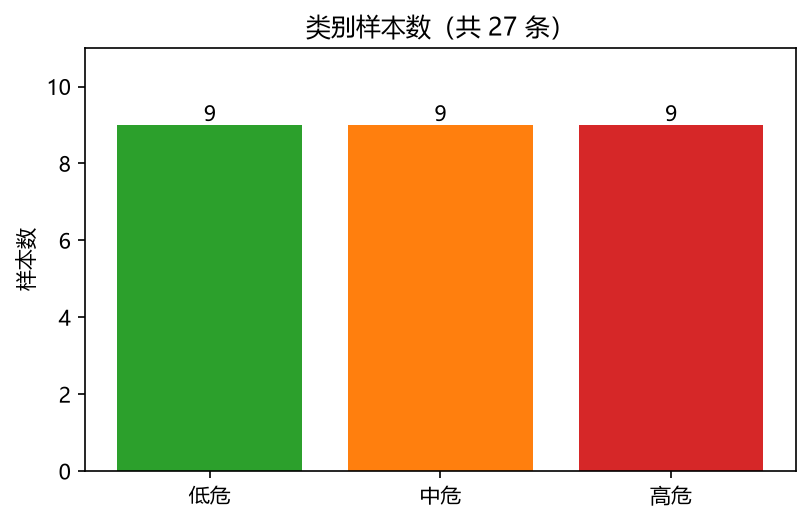

原始附件 SHA-256（确认未修改）：
- `inputs/声诊练习.xlsx`：`34355839cf5ca5945600f348dafc4ba2e4608f5a989815335c4b32ec2b7cbf26`
- `inputs/中医声诊实验.docx`：`44080bc706df51d66e1211bc5d85a48970ab777e9169bcd58dd6d758472518f3`

## 3 环境核验

- 操作系统 / 架构：Windows-11-10.0.26200-SP0 / AMD64
- 解释器：3.14.7，路径 `C:\Users\swild\Documents\中医声诊项目_最终交付\.venv\Scripts\python.exe`
- `python -m pip check`：No broken requirements found.
- 关键包版本：
- matplotlib==3.11.2
- numpy==2.5.3
- pandas==3.0.6
- scikit-learn==1.9.1
- scipy==1.18.1
- seaborn==0.13.2
- shap==0.52.0
- xgboost==3.4.1

## 4 结果

### 4.1 OOF 汇总指标（27 条折外预测，种子 42）

下表为从 OOF 预测重新计算的完整汇总值（区别于逐折均值的平均）。

| 模型 | 版本 | accuracy | precision_macro | recall_macro | f1_macro | roc_auc_macro | mAP | pr_auc_macro |
| --- | --- | --- | --- | --- | --- | --- | --- | --- |
| Logistic Regression (逻辑回归) | 未调参 | 0.370 | 0.386 | 0.370 | 0.377 | 0.512 | 0.429 | 0.391 |
| Logistic Regression (逻辑回归) | 调参 | 0.296 | 0.329 | 0.296 | 0.309 | 0.457 | 0.361 | 0.321 |
| SVM (支持向量机) | 未调参 | 0.481 | 0.463 | 0.481 | 0.466 | 0.626 | 0.475 | 0.434 |
| SVM (支持向量机) | 调参 | 0.407 | 0.344 | 0.407 | 0.365 | 0.537 | 0.468 | 0.443 |
| Gaussian Naive Bayes (高斯朴素贝叶斯) | 未调参 | 0.519 | 0.524 | 0.519 | 0.518 | 0.603 | 0.514 | 0.483 |
| Gaussian Naive Bayes (高斯朴素贝叶斯) | 调参 | 0.481 | 0.482 | 0.481 | 0.481 | 0.586 | 0.501 | 0.470 |
| KNN (K 近邻) | 未调参 | 0.444 | 0.310 | 0.444 | 0.364 | 0.621 | 0.437 | 0.383 |
| KNN (K 近邻) | 调参 | 0.370 | 0.277 | 0.370 | 0.316 | 0.551 | 0.423 | 0.407 |
| Random Forest (随机森林) | 未调参 | 0.481 | 0.402 | 0.481 | 0.433 | 0.626 | 0.540 | 0.506 |
| Random Forest (随机森林) | 调参 | 0.556 | 0.537 | 0.556 | 0.539 | 0.588 | 0.521 | 0.495 |
| XGBoost | 未调参 | 0.444 | 0.482 | 0.444 | 0.458 | 0.593 | 0.481 | 0.448 |
| XGBoost | 调参 | 0.481 | 0.491 | 0.481 | 0.479 | 0.658 | 0.543 | 0.507 |
| Dummy (先验基线) | 基线 | 0.259 | 0.231 | 0.259 | 0.223 | 0.420 | 0.301 | 0.316 |

*注：SVM 的 ROC/PR 使用 decision_function 决策分数（非概率、未做校准），不参与概率行和≈1 的检查；其余模型为 predict_proba 概率。*

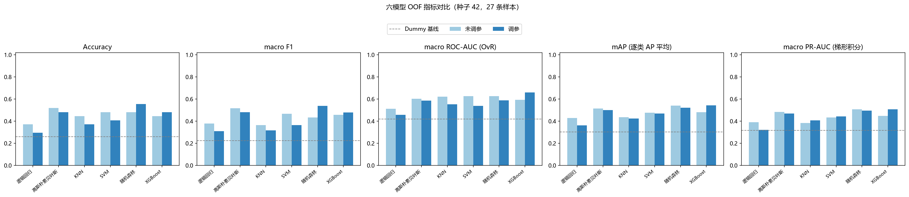

### 4.2 逐折指标（均值 ± 标准差，跨 5 个外层折）

标准差是跨折变动，不是置信区间。

| 模型 | 版本 | accuracy | precision_macro | recall_macro | f1_macro | roc_auc_macro | mAP | pr_auc_macro |
| --- | --- | --- | --- | --- | --- | --- | --- | --- |
| Dummy 基线 | 基线 | 0.253±0.065 | 0.084±0.022 | 0.333±0.000 | 0.133±0.027 | 0.500±0.000 | 0.333±0.000 | 0.667±0.000 |
| 高斯朴素贝叶斯 | 调参 | 0.480±0.129 | 0.478±0.188 | 0.500±0.149 | 0.453±0.118 | 0.622±0.116 | 0.601±0.105 | 0.491±0.148 |
| 高斯朴素贝叶斯 | 未调参 | 0.520±0.181 | 0.511±0.266 | 0.533±0.194 | 0.487±0.199 | 0.650±0.142 | 0.621±0.126 | 0.513±0.165 |
| KNN | 调参 | 0.373±0.131 | 0.283±0.067 | 0.367±0.163 | 0.304±0.094 | 0.558±0.140 | 0.492±0.136 | 0.519±0.094 |
| KNN | 未调参 | 0.447±0.202 | 0.283±0.156 | 0.400±0.170 | 0.324±0.161 | 0.632±0.119 | 0.522±0.100 | 0.540±0.163 |
| 逻辑回归 | 调参 | 0.293±0.183 | 0.311±0.213 | 0.300±0.194 | 0.287±0.183 | 0.464±0.122 | 0.521±0.120 | 0.416±0.159 |
| 逻辑回归 | 未调参 | 0.380±0.139 | 0.344±0.142 | 0.367±0.125 | 0.333±0.110 | 0.481±0.126 | 0.544±0.113 | 0.447±0.148 |
| 随机森林 | 调参 | 0.560±0.049 | 0.504±0.076 | 0.533±0.067 | 0.483±0.037 | 0.592±0.092 | 0.603±0.085 | 0.506±0.128 |
| 随机森林 | 未调参 | 0.480±0.147 | 0.438±0.075 | 0.467±0.163 | 0.416±0.101 | 0.611±0.166 | 0.626±0.135 | 0.548±0.177 |
| SVM | 调参 | 0.407±0.053 | 0.306±0.096 | 0.400±0.082 | 0.329±0.077 | 0.511±0.141 | 0.542±0.071 | 0.434±0.054 |
| SVM | 未调参 | 0.473±0.104 | 0.427±0.224 | 0.467±0.125 | 0.405±0.147 | 0.622±0.119 | 0.608±0.118 | 0.503±0.166 |
| XGBoost | 调参 | 0.473±0.164 | 0.467±0.143 | 0.433±0.170 | 0.427±0.145 | 0.642±0.148 | 0.643±0.115 | 0.560±0.128 |
| XGBoost | 未调参 | 0.440±0.116 | 0.439±0.143 | 0.433±0.133 | 0.416±0.132 | 0.567±0.190 | 0.576±0.129 | 0.469±0.148 |

### 4.3 调参搜索预算

| 模型 | 搜索类型 | 空间大小 | 每折候选 | 每折拟合数 | 调参总拟合数 |
| --- | --- | --- | --- | --- | --- |
| 逻辑回归 | grid | 5 | 5 | 15 | 75 |
| SVM | grid | 20 | 20 | 60 | 300 |
| 高斯朴素贝叶斯 | grid | 5 | 5 | 15 | 75 |
| KNN | grid | 16 | 16 | 48 | 240 |
| 随机森林 | random | 48 | 20 | 60 | 300 |
| XGBoost | random | 144 | 20 | 60 | 300 |

### 4.4 调参前后对比

- 逻辑回归：macro-F1 0.377 → 0.309（下降 -0.069）。
- SVM：macro-F1 0.466 → 0.365（下降 -0.101）。
- 高斯朴素贝叶斯：macro-F1 0.518 → 0.481（下降 -0.037）。
- KNN：macro-F1 0.364 → 0.316（下降 -0.048）。
- 随机森林：macro-F1 0.433 → 0.539（提升 +0.105）。
- XGBoost：macro-F1 0.458 → 0.479（提升 +0.021）。

各模型外层折最优超参数（取多数出现或逐折记录见 `results/seed42/folds.csv`）：

| 模型 | 最优参数（多数） | 出现折数 |
| --- | --- | --- |
| 逻辑回归 | {'C': 10.0} | 2/5 |
| SVM | {'C': 10.0, 'gamma': 'scale', 'kernel': 'rbf'} | 4/5 |
| 高斯朴素贝叶斯 | {'var_smoothing': 0.001} | 4/5 |
| KNN | {'n_neighbors': 3, 'p': 1, 'weights': 'uniform'} | 2/5 |
| 随机森林 | {'max_depth': 2, 'max_features': 1.0, 'min_samples_leaf': 1, 'n_estimators': 100} | 1/5 |
| XGBoost | {'colsample_bytree': 1.0, 'learning_rate': 0.03, 'max_depth': 1, 'n_estimators': 50, 'reg_lambda': 1.0, 'subsample': 1.0} | 2/5 |

### 4.5 训练分数与外层分数差距（过拟合观察）

| 模型 | 版本 | train_f1_macro | train_accuracy | oof_f1_macro | oof_accuracy |
| --- | --- | --- | --- | --- | --- |
| 逻辑回归 | 未调参 | 0.741 | 0.750 | 0.377 | 0.370 |
| 逻辑回归 | 调参 | 0.677 | 0.710 | 0.309 | 0.296 |
| SVM | 未调参 | 0.914 | 0.916 | 0.466 | 0.481 |
| SVM | 调参 | 0.919 | 0.933 | 0.365 | 0.407 |
| 高斯朴素贝叶斯 | 未调参 | 0.838 | 0.842 | 0.518 | 0.519 |
| 高斯朴素贝叶斯 | 调参 | 0.765 | 0.777 | 0.481 | 0.481 |
| KNN | 未调参 | 0.491 | 0.584 | 0.364 | 0.444 |
| KNN | 调参 | 0.755 | 0.794 | 0.316 | 0.370 |
| 随机森林 | 未调参 | 1.000 | 1.000 | 0.433 | 0.481 |
| 随机森林 | 调参 | 0.972 | 0.972 | 0.539 | 0.556 |
| XGBoost | 未调参 | 1.000 | 1.000 | 0.458 | 0.444 |
| XGBoost | 调参 | 0.924 | 0.927 | 0.479 | 0.481 |

### 4.6 六模型曲线对比（OOF 分数）

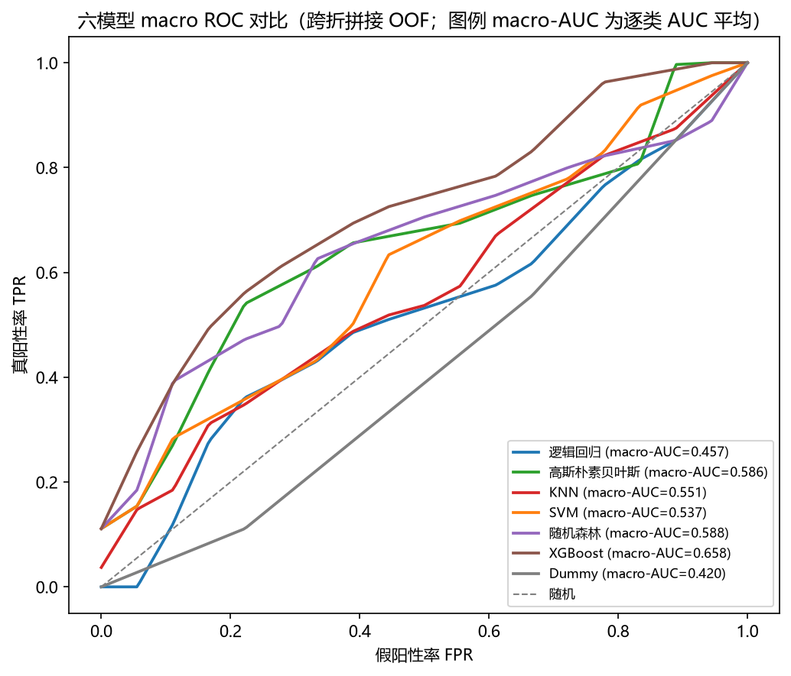

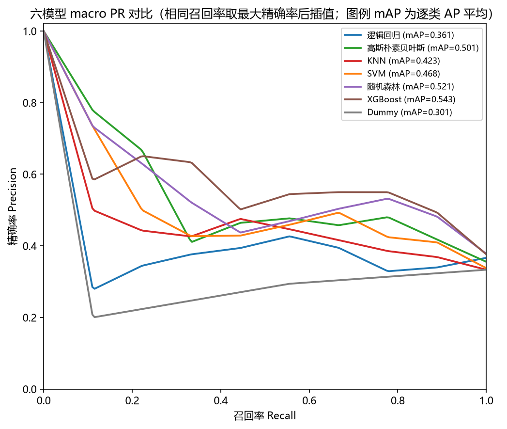

*读图口径（四点，容易误读）：*

1. 图例中的 macro-AUC 来自**逐类 ROC-AUC 算术平均**、mAP 来自**逐类 AP 算术平均**，两者都**不是**平均曲线本身的面积，不要互相替代。
2. macro PR 曲线按「**相同召回率取最大精确率**」去重后再线性插值到公共 recall 网格。该做法会消除垂直段、使曲线偏高，因此平均曲线下方的面积**大于** mAP 与梯形 PR-AUC（三者算法不同：mAP=逐类 AP 平均、pr_auc_macro=逐类梯形积分、此图=插值后平均曲线）。把这里的 max 直接改成 min 也不是通用正确修复；换展示口径需另行说明。
3. 曲线由**跨折拼接**的 OOF 分数绘制。Dummy 每折 AUC≈0.5，但拼接后约 0.42，这是不同训练折先验分数之间的排序效应，**不应**把该曲线当作理论随机基线，也不代表 AUC 实现有误。
4. SVM 的分数是 decision_function 决策分数，跨折可能存在尺度差异，故同时保留逐折指标。

### 4.7 逐类 ROC / PR 曲线

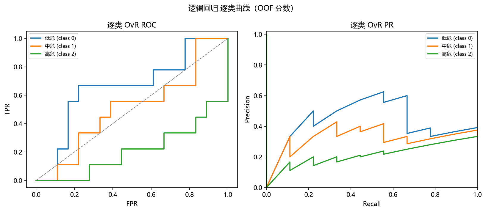

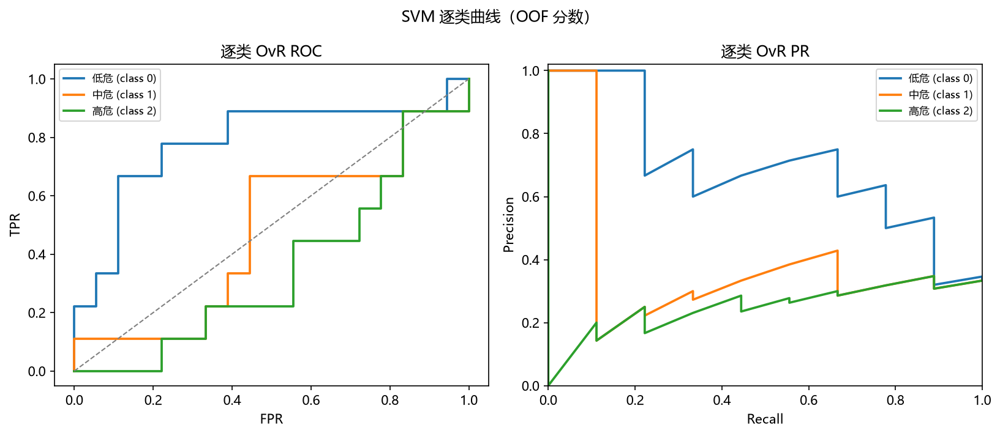

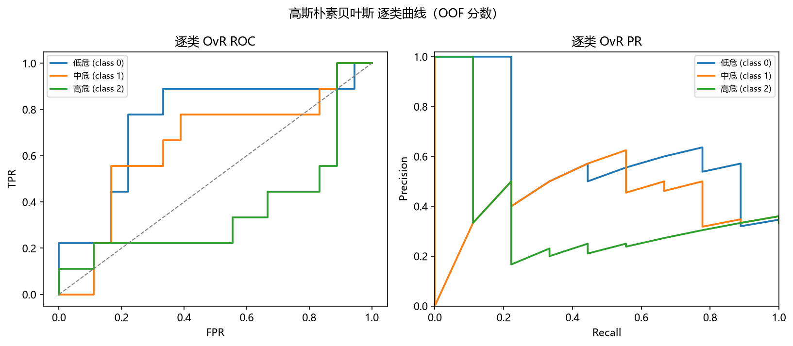

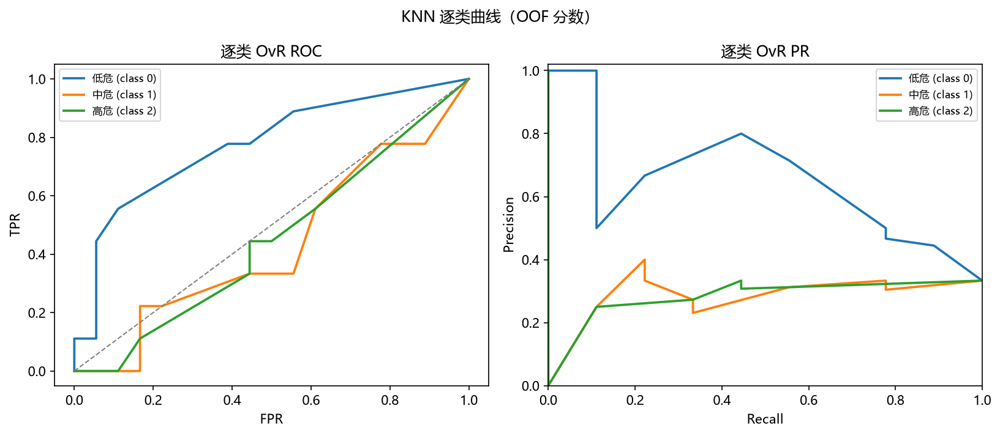

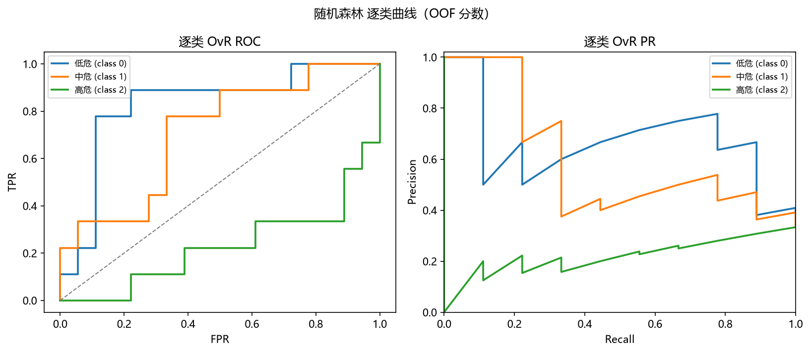

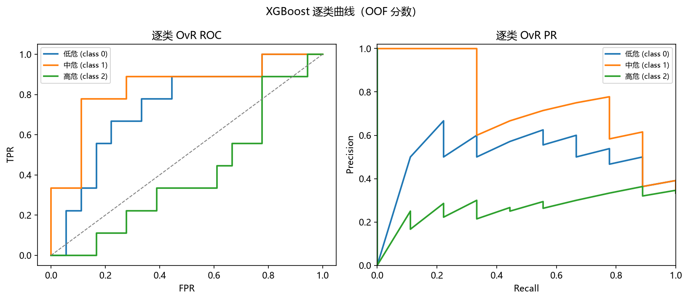

### 4.8 混淆矩阵

按预先确定的 macro-F1，胜者为 **Random Forest (随机森林)**（OOF macro-F1=0.539，Accuracy=0.556）。单独标记的 Accuracy 最高模型为 **Random Forest (随机森林)**（Accuracy=0.556）。

按真实类别拆开看，胜者的逐类召回率为：低危 **77.8%**（7/9）、中危 **66.7%**（6/9）、高危 **仅 22.2%**（2/9）。

也就是说，7 条真实高危样本没有被识别为高危。在三分类风险预警里，这比「哪个模型是冠军」重要得多：**模型对最需要预警的类别几乎失效**，高分主要来自低危与中危两类。任何关于本实验「可用性」的表述都必须先说明这一点。（这里评价的是给定标签下的实验表现，不推断真实疾病结局。）

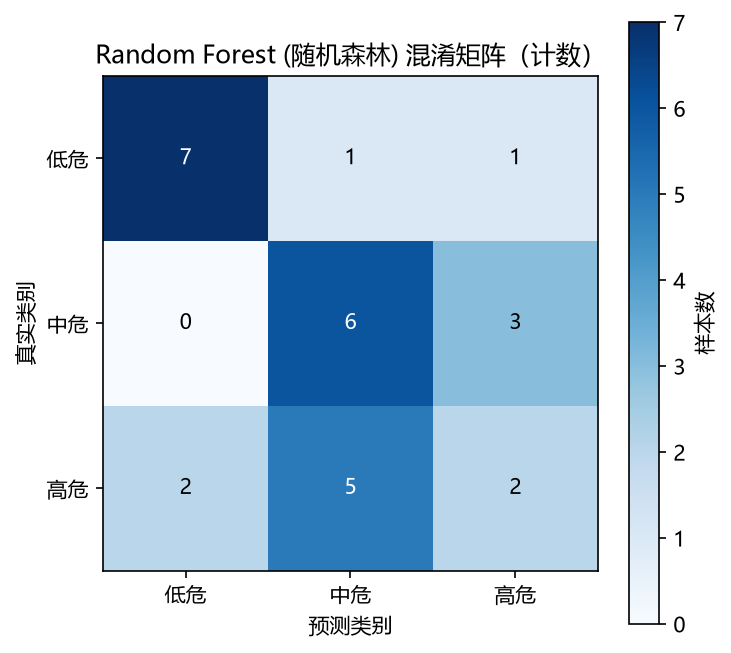

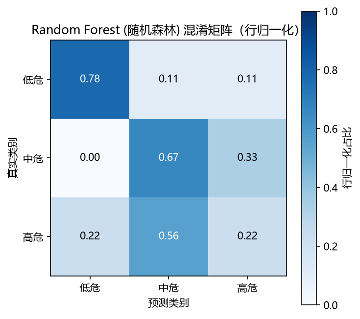

### 4.9 SHAP 特征重要性（训练后描述性分析）

- 解释对象：最终所选模型（Random Forest (随机森林)）。
- 解释器：TreeExplainer(tree_path_dependent)；背景：原始特征空间（树模型无缩放；imputer 恒等，已验证）；解释对象：全部 27 条训练样本；输出空间：predict_proba 概率。
- 说明：训练后描述性分析，非外部验证，非因果关系证据；解释空间见 background 字段。

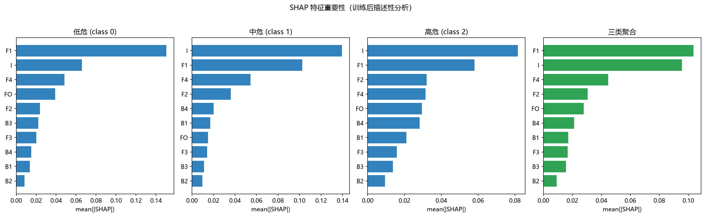

三类聚合 mean(|SHAP|) 排名：

| 特征 | mean(|SHAP|) | 排名 |
| --- | --- | --- |
| F1 | 0.10359078358334227 | 1 |
| I | 0.09559818569032741 | 2 |
| F4 | 0.04475548577096555 | 3 |
| F2 | 0.03062599877420821 | 4 |
| FO | 0.027818790059675774 | 5 |
| B4 | 0.021159416730440878 | 6 |
| B1 | 0.01720575327004047 | 7 |
| F3 | 0.01670556060836223 | 8 |
| B3 | 0.01567856617974038 | 9 |
| B2 | 0.009117741566374795 | 10 |

### 4.10 切分稳定性（种子 43、44 补充）

以下为各模型（调参版）在三个种子下的 OOF 指标，用于观察表现对切分的敏感性。重复切分不是新增独立样本，不能把 81 次预测当作 81 名患者来缩小置信区间。

| 种子 | 模型 | accuracy | f1_macro | roc_auc_macro | mAP | pr_auc_macro |
| --- | --- | --- | --- | --- | --- | --- |
| 42 | 逻辑回归 | 0.296 | 0.309 | 0.457 | 0.361 | 0.321 |
| 42 | SVM | 0.407 | 0.365 | 0.537 | 0.468 | 0.443 |
| 42 | 高斯朴素贝叶斯 | 0.481 | 0.481 | 0.586 | 0.501 | 0.470 |
| 42 | KNN | 0.370 | 0.316 | 0.551 | 0.423 | 0.407 |
| 42 | 随机森林 | 0.556 | 0.539 | 0.588 | 0.521 | 0.495 |
| 42 | XGBoost | 0.481 | 0.479 | 0.658 | 0.543 | 0.507 |
| 43 | 逻辑回归 | 0.222 | 0.228 | 0.412 | 0.326 | 0.290 |
| 43 | SVM | 0.333 | 0.308 | 0.484 | 0.373 | 0.329 |
| 43 | 高斯朴素贝叶斯 | 0.296 | 0.312 | 0.484 | 0.417 | 0.380 |
| 43 | KNN | 0.481 | 0.412 | 0.605 | 0.435 | 0.453 |
| 43 | 随机森林 | 0.370 | 0.368 | 0.549 | 0.466 | 0.429 |
| 43 | XGBoost | 0.407 | 0.400 | 0.586 | 0.471 | 0.442 |
| 44 | 逻辑回归 | 0.370 | 0.371 | 0.521 | 0.417 | 0.375 |
| 44 | SVM | 0.556 | 0.547 | 0.695 | 0.610 | 0.586 |
| 44 | 高斯朴素贝叶斯 | 0.444 | 0.420 | 0.556 | 0.484 | 0.456 |
| 44 | KNN | 0.444 | 0.431 | 0.582 | 0.420 | 0.419 |
| 44 | 随机森林 | 0.444 | 0.429 | 0.586 | 0.530 | 0.496 |
| 44 | XGBoost | 0.556 | 0.547 | 0.630 | 0.537 | 0.508 |

### 4.11 不确定性量化与选择乐观性（补充分析）

本节为**补充分析**，不改动 §2 预先固定的主实验规则（随机种子、外层/内层切分、内层评分、胜者判定规则全部不变），只对已经算出的折外预测做进一步的统计刻画。

下表是对 27 条折外预测做**样本级 bootstrap 重采样（2000 次）**得到的百分位区间。它刻画的是「这 27 条样本」内部的抽样波动，**不是**人群抽样分布，也不能把种子 42/43/44 的 81 次重复预测当成 81 名患者。

**有效抽样规则**：一次抽样只有**三类都出现**时才计入；缺任一类则该次对**全部指标**作废（计入「缺类作废数」）。不按剩余类别凑一个 macro 值、也不用 0 顶替——否则 macro 平均的类别数会在各次之间变化。本轮实际未出现缺类抽样（各模型「缺类作废数」均为 0），但规则与代码、测试一致。

**适用范围（重要）**：本区间固定了已经拟合好的折外预测，只重采样行；它**没有**重新执行训练、调参、切分与胜者选择，也未建模交叉验证各折训练集之间的重叠。因此它**不是**「完整建模流程泛化性能」的已证 95% 置信区间。

| 模型 | 指标 | OOF 点估计 | bootstrap 95% 区间 | 重采样次数 | 有效重采样数 | 缺类作废数 |
| --- | --- | --- | --- | --- | --- | --- |
| 逻辑回归 | accuracy | 0.296 | [0.148, 0.481] | 2000 | 2000 | 0 |
| 逻辑回归 | f1_macro | 0.309 | [0.131, 0.470] | 2000 | 2000 | 0 |
| 逻辑回归 | roc_auc_macro | 0.457 | [0.329, 0.604] | 2000 | 2000 | 0 |
| 逻辑回归 | mAP | 0.361 | [0.310, 0.529] | 2000 | 2000 | 0 |
| SVM | accuracy | 0.407 | [0.222, 0.593] | 2000 | 2000 | 0 |
| SVM | f1_macro | 0.365 | [0.226, 0.508] | 2000 | 2000 | 0 |
| SVM | roc_auc_macro | 0.537 | [0.375, 0.690] | 2000 | 2000 | 0 |
| SVM | mAP | 0.468 | [0.367, 0.615] | 2000 | 2000 | 0 |
| 高斯朴素贝叶斯 | accuracy | 0.481 | [0.296, 0.667] | 2000 | 2000 | 0 |
| 高斯朴素贝叶斯 | f1_macro | 0.481 | [0.301, 0.646] | 2000 | 2000 | 0 |
| 高斯朴素贝叶斯 | roc_auc_macro | 0.586 | [0.424, 0.755] | 2000 | 2000 | 0 |
| 高斯朴素贝叶斯 | mAP | 0.501 | [0.389, 0.700] | 2000 | 2000 | 0 |
| KNN | accuracy | 0.370 | [0.185, 0.556] | 2000 | 2000 | 0 |
| KNN | f1_macro | 0.316 | [0.177, 0.439] | 2000 | 2000 | 0 |
| KNN | roc_auc_macro | 0.551 | [0.409, 0.710] | 2000 | 2000 | 0 |
| KNN | mAP | 0.423 | [0.345, 0.587] | 2000 | 2000 | 0 |
| 随机森林 | accuracy | 0.556 | [0.370, 0.741] | 2000 | 2000 | 0 |
| 随机森林 | f1_macro | 0.539 | [0.362, 0.701] | 2000 | 2000 | 0 |
| 随机森林 | roc_auc_macro | 0.588 | [0.440, 0.727] | 2000 | 2000 | 0 |
| 随机森林 | mAP | 0.521 | [0.409, 0.680] | 2000 | 2000 | 0 |
| XGBoost | accuracy | 0.481 | [0.296, 0.667] | 2000 | 2000 | 0 |
| XGBoost | f1_macro | 0.479 | [0.295, 0.646] | 2000 | 2000 | 0 |
| XGBoost | roc_auc_macro | 0.658 | [0.504, 0.811] | 2000 | 2000 | 0 |
| XGBoost | mAP | 0.543 | [0.444, 0.730] | 2000 | 2000 | 0 |
| Dummy 基线 | accuracy | 0.259 | [0.111, 0.407] | 2000 | 2000 | 0 |
| Dummy 基线 | f1_macro | 0.223 | [0.083, 0.363] | 2000 | 2000 | 0 |
| Dummy 基线 | roc_auc_macro | 0.420 | [0.313, 0.553] | 2000 | 2000 | 0 |
| Dummy 基线 | mAP | 0.301 | [0.294, 0.387] | 2000 | 2000 | 0 |

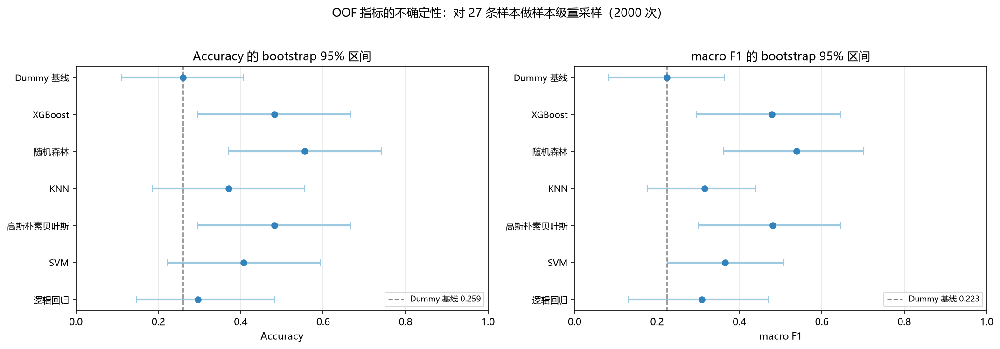

**胜者与先验基线的配对检验**

胜者 **随机森林** 与 Dummy 先验基线使用同一组 27 条折外预测，可作配对比较：两者都判对 3 条、都判错 8 条，胜者判对而基线判错 12 条、反之 4 条。精确 McNemar 双尾 p = **0.0768**，在 0.05 水平下**不显著**：以本样本量尚不能认为胜者优于先验基线。 不一致对仅 16 条，检验功效很低；p 不显著只表示「未观察到显著差异」，不等于「两者相同」。

**局限**：应把本检验视为**探索性比较**。「精确」仅指二项尾概率的算法精确——胜者本身来自同一批折外预测的筛选、各折模型又共享训练数据，因此它不构成对整个「选模流程」的精确检验；且它只比较**错误率**，不涉及 macro-F1、ROC-AUC 或排序质量。不宜把该 p 值当作强证据。

**含模型选择的无事后挑选估计**

这里换一种**不含事后挑选**的做法：每个外层折只按**该折的内层 macro-F1** 决定用哪个模型（折 0→XGBoost、折 1→KNN、折 2→KNN、折 3→XGBoost、折 4→XGBoost），再拼接各折折外预测。结果为 Accuracy=0.481、macro-F1=0.462；作为对照，事后在同一批折外预测上挑出的 **随机森林** 为 Accuracy=0.556、macro-F1=0.539。

**这两个数值不能相减来解释为偏差的大小。** 它们来自**两套不同的选模策略**：前者外层实际用的是 KNN/XGBoost，后者用的是 随机森林。两者之差同时混合了(a)策略不同、(b)有限样本波动、(c)事后挑选的乐观性三种来源，无法单独识别 (c)，更不能当作随机森林经偏差校正后的成绩。

由此能得到的结论只有一条：**本次结果对「用哪种方式选模型」是敏感的**——内层选择策略在外层评估中表现更差，且各折选出的模型并不固定在随机森林上，说明当前样本量下模型排名本身不稳定。该估计衡量的是「模型选择这个过程」的表现，仍不是独立外部测试集。

## 5 最终模型

最终演示模型为 **Random Forest (随机森林)**，在全部 27 条样本上重新做训练内 3 折调参后拟合。
- 最终超参数：`{'n_estimators': 300, 'min_samples_leaf': 1, 'max_features': 1.0, 'max_depth': None}`
- 训练内 CV 最优 macro-F1：0.470
- 训练集（全 27 条）Accuracy=1.000，macro-F1=1.000（训练集得分不得替代上面的 OOF 性能）。
- 分数类型：predict_proba 概率。
- 已保存：`models/final_pipeline.joblib`（含预处理+模型），`models/final_metadata.json`（特征顺序与标签映射）。

## 6 结论与限制

在当前 27 条样本、外层 5 折内层 3 折嵌套 CV 方案下，按**预先固定**的 macro-F1 规则，胜者为 **Random Forest (随机森林)**（OOF macro-F1=0.5386、Accuracy=0.5556）。

但必须同时说明三点：

1. **它只在部分指标上胜出。** macro ROC-AUC 与 mAP 最好的调参模型分别是 XGBoost（AUC=0.6584）与 XGBoost（mAP=0.5425），不能说随机森林在所有指标上都最优。
2. **胜者的分数含事后挑选的乐观性。** 它是在同一批折外预测上挑出的最高分；各模型的嵌套评估不能自动成为「获胜模型选择过程」的无偏估计。（报告 §4.11 另给出一个不含事后挑选的内层选择策略结果作为对照，但那是**另一套策略**的表现，两者之差不可解释为偏差大小。）
3. **逐类看，最要紧的问题是高危类几乎识别不出**（召回率见 §4.8）。整体 Accuracy 主要由低危与中危两类支撑。

调参对个别模型有提升（如随机森林、XGBoost），对部分模型反而下降，反映出小样本下内层选择噪声大。受样本量限制，所有模型 OOF 指标波动较大，不能据此声称临床部署有效或外部人群泛化良好。

### 6.1 关键限制

- 仅 27 条样本（每类 9 条），外层每折仅 5–6 条，OOF 指标方差大、置信范围宽；任何结论都是低统计功效下的初步观察。
- 没有患者 ID，无法核实同一人是否存在重复录音跨行；本实验把‘每行独立’作为暂定假设，未声称已排除患者级泄漏。
- 标准差是跨折变动，不是置信区间，也不是临床不确定性范围。
- 获胜模型得分存在选择乐观性（在多个模型中挑最高分本身会高估该模型）。
- SHAP 为全量训练后描述性分析，不是外部验证解释，也不是因果关系证据。
- 样本来源、特征单位与采集协议未提供，结果不可外推到其他人群或设备。
- 胜者的 bootstrap 95% 区间很宽：Accuracy [0.370, 0.741]、macro-F1 [0.362, 0.701]，各模型区间大量重叠，不能按点估计大小排出可信的名次。
- 胜者相对 Dummy 先验基线的精确 McNemar 检验 p=0.0768（>0.05），以本样本量尚不足以证明「有真实优于基线的判别能力」。
- 内层选择策略（每折按内层 macro-F1 选模型）在外层评估中得 Accuracy=0.481、macro-F1=0.462，低于事后挑出的胜者分数。但这是**两套不同策略**的结果，差值同时混合策略差异、有限样本波动与选择效应，**不能解释为选择偏差的大小**，也不是胜者的偏差校正成绩；能说的只是结论对「用哪种方式选模型」敏感。
- bootstrap 区间固定了已经拟合好的折外预测，只对 27 行做样本级重采样；它**没有**重新执行训练、调参、切分与胜者选择，也未建模交叉验证各折训练集之间的重叠。因此不能把它当作「完整建模流程泛化性能」的已证 95% 置信区间。本轮 2000 次重采样中未出现缺类抽样（见 results/uncertainty.csv 的 n_invalid 列），故区间数值未受缺类处理规则影响。
- McNemar 检验的「精确」仅指二项尾概率的算法精确。由于胜者本身来自同一批折外预测的筛选、各折模型又共享训练数据，它不构成对整个选模流程的精确检验；它也比较错误率，不检验 macro-F1、AUC 或排序质量。应按**探索性比较**理解，其 p 值不宜作为强证据。

---

报告由 `main.py` 自动生成；复现命令见 `README.md`。所有原始附件保持不变。
